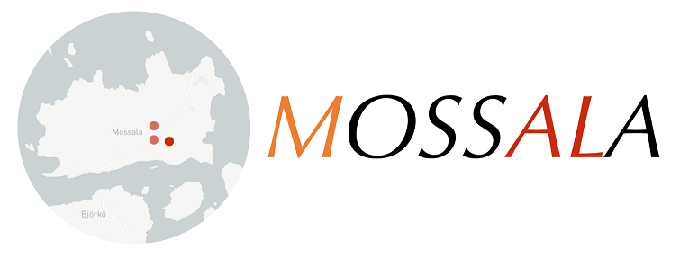

Multiple OSS Access Log Analyzer
================

This is a web application that graphically analyzes access logs from Apache, Tomcat, etc.

Quick Start on Streamlit Cloud
--------------------

Click 👉 |ImageLink|_ 

.. |ImageLink| image:: https://static.streamlit.io/badges/streamlit_badge_black_white.svg
.. _ImageLink: https://share.streamlit.io/k-tamura/mossala/main/

Start locally
--------------------

::

    $ git clone https://github.com/k-tamura/mossala.git
    $ cd mossala/
    $ pip install -r requirements.txt
    $ streamlit run streamlit_app.py

To stop:
^^^^^^^^

Use :kbd:`CTRL` + :kbd:`C`
